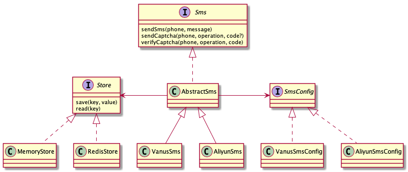

# Kequandian SMS

## SMS-SDK




### 如何使用

```java
VanusSmsConfig config = new VanusSmsConfig();
config.setAccount("account1");
config.setPassword("pwd1");
config.setUrl("http://127.0.0.1:8080/vanusSms");
config.setUserId("user1");
Sms sms = new VanusSms(config);
sms.sendCaptcha(req.getPhone(), req.getOperation());
```


### 如何扩展

继承`AbstractSms`类，提供`sendMessage`的实现

添加该vendor的一个配置项的实现类

```java
class TencentSmsConfig implements SmsConfig {
  private String key;
  private String secret;
}
class TencentSms extends AbstractSms {
  private TencentSmsConfig config;
  public TencentSms(TencentSmsConfig config) {
    super(config);
    this.config = config;
  }
  @override
  public void sendMessage(String phone, String message) {
    // use tencent sdk to send message
  }
}
```


## SMS-BOOT

SMS SDK的使用示例

```json
POST /api/sms/v1/captcha
{
  "phone": "13800000000",
  "opeartion": "register"
}

POST /api/sms/v1/verify
{
  "phone": "13800000000",
  "opeartion": "register",
  "code": "1235"
}
```

## 配置

应用层提供配置的实现，通过`SmsConfig`注入给Sms使用。

配置可能是来自配置文件，也可能来自数据库，或者其他微服务的接口提供。

Verify通常是和业务关联的，建议在业务层通过调用SDK的verify方法来使用，而不是直接提供接口给前端，否则会有漏洞。

